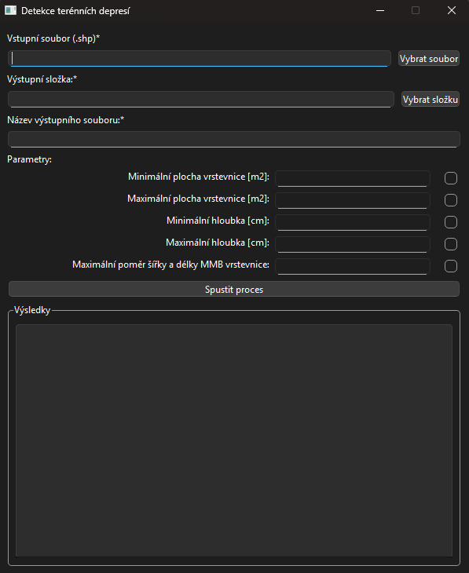

# SinkholeDetection

## Popis

- Proces pro vyhledávání teréních depresí
- Proces se spouští přes uživatelské prostředí
- Vstupem do procesu jsou vektorové linie vrstevnic ve formátu SHP
- Výstupem z procesu jsou vektorové polygony terénních depresí ve formátu SHP
- Proces provádí filtraci podle zadaných parametrů

## Instalace

### Podmínky použití

- Python 3.13.2 64-bit

### Před spuštěním

- Instalace nástroje probíhá pomocí souboru `setup.py`.
- Soubor vytvoří virtuální prostředí s požadovanými knihovnami a soubor `start.bat`, který spouští proces v tomto prostředí.

## Použití

- Proces je spuštěn souborem `start.bat`.
- Tento soubor otevře uživatelské prostředí.

### Uživatelské prostředí

- Uživatelské prostředí:

- Uživatelské prostředí vyžaduje vstupní data
    - Vstupní soubor:
        - Cesta ke vstupnímu souboru.
        - Soubor musí mít koncovku *.shp.
        - Soubor musí existovat.
    - Výstupní složce:
        - Cesta k výstupní složce.
        - Složka musí existovat.
    - Název výstupního souboru:
        - Text názvu souboru.
        - Soubor složený z výstupní složky, názvu a koncovky *.shp nesmí existovat.
    - Parametry (Nepovinné):
        - Parametry pro filtaci nalezených depresí.
        - Parametry musí být celé kladné číslo.
        - Ve verzi 1.0.0 je povoleno 5 parametrů:
            - Minimální plocha vrstevnice v metrech.
            - Maximální plocha vrstevnice v metrech.
            - Minimální hloubka deprese v centimetrech.
            - Maximální hloubka deprese v centimetrech.
            - Maximální poměr šířky a délky MMB.
                - Poměr delší/kratší strany nesmí přesáhnout vloženou hodnotu.
        - U parametrů je CheckBox, který je v základu nezaškrtnutý.
            - Pokud je nezaškrtnutý, tak je hodnota prázdná a vložení parametru není možné.
            - Pokud je zaškrtnutý, tak se povolí vložení parametru.
                Pokud zůstane pole pro vložení parametru prázdné, tak parametr také neni použit.

- Po vložení parametrů je proces spuštěn tlačítkem `Spustit proces`
    - Proběhne test vstupních parametrů a pokud je v nich chyba, tak v sekci Výsledky proběhne varování o chybě a nespuštění procesu.
    - Pokud je test v pořádku, tak je proces spuštěn.
        - Vypíše se informace o startu procesu
        - Po dokončení procesu se vypíše informace o dokončení procesu.
            Pokud v pruběhu procesu nastane chyba, tak se vypíše informace o chybě.

- Pokud proces proběhne správně, tak se na vložené ceste vytvoří *.shp

## Autor

- Vojtěch Müller
- Verze: 1.0.0
- Datum 15.5.2025